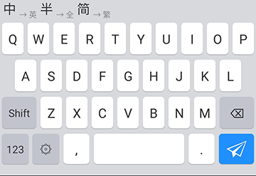

**[单静][1] 可能是最精致的 [同文输入法][2] 主题**

[1]: https://github.com/cxcn/danjing
[2]: https://github.com/osfans/trime

## 预览



更多图片在 `preview` 文件夹下查看

## 按键功能

|  按键  | 手势         | 功能                               |
| :----: | ------------ | :--------------------------------- |
| 第一排 | 下滑         | 输入数字（4 和 7 作为定位）        |
|  空格  | 长按         | 切换中英文                         |
|  退格  | 上滑         | 清屏                               |
|  回车  | 长按         | 进入功能键盘，可以临时切换键盘布局 |
|   o    | 左右滑动     | 输入单个括号                       |
|   g    | 下滑         | 进入编辑键盘                       |
|   n    | 上下左右滑动 | 移动光标                           |

---

## FAQ：

### 1. 怎么设置 26 键（或者其他布局）为默认布局？

在对应的主题文件中搜索 `preset_keyboards`，找到如下字段

```yaml
preset_keyboards:
  __include: danjing:/kbs
```

像下面这样添加一段代码

```yaml
preset_keyboards:
  __include: danjing:/kbs
  <你的方案id>:
    __include: /preset_keyboards/<布局id>
```

| 布局  | id         |
| ----- | ---------- |
| 26 键 | `default`  |
| 27 键 | `qwertys`  |
| 30 键 | `qwerty\_` |

### 2. 怎么修改键盘高度？

为了确保不同布局高度一致，请先修改 **数字** 和 **符号** 键盘高度  
使其一致，最后修改 **主键盘** 高度。

```yaml
# 单静.trime.yaml
# start line: 8

conf:
  # 主键盘
  main:
    height: 52 #按键高度
    horizontal_gap: 3 #按键水平间距
    vertical_gap: 5 #按键行距
    key_symbol_offset_x: 3
    key_hint_offset_y: -1
    key_press_offset_x: 2
    key_press_offset_y: 2
    keys/+:
      - width: 100 #底部留白开关，0为关，1~100开
        height: 6 #底部留白
    __patch: 单静.patch.无障碍:/main?
  key_height_last: # 第4行 按键高度
    height: 50
    __patch: 单静.patch.无障碍:/key_height_last?
  # 数字、编辑、功能键盘配置
  num:
    height: 60 #按键高度
    key_press_offset_x: 2
    key_press_offset_y: 2
    keys/+:
      - width: 0 #底部留白开关
        height: 1 #底部留白
  # 符号、颜文字键盘
  sym_height: 50 #按键高度
  menu_height: 41 #菜单高度
  sym_bottom_switch: 0 #底部留白开关
  sym_bottom: 1 #底部留白
  sym_long_text_size: 20 #长标签字号
```

```yaml
# 单静+.trime.yaml
# start line: 8

conf:
  # 其他参数在 单静.trime.yaml 修改
  # 数字、编辑、功能键盘
  num_height: 71 #按键高度
  # 添加数字行
  num_line:
    height: 39 # 数字行按键高度
    __patch: 单静.patch.无障碍:/num_line?

# line: 33

style:
  __include: 单静.trime:/style
  key_height: 61 #符号、颜文字键盘 按键高度
```
